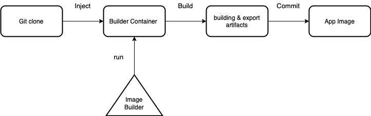
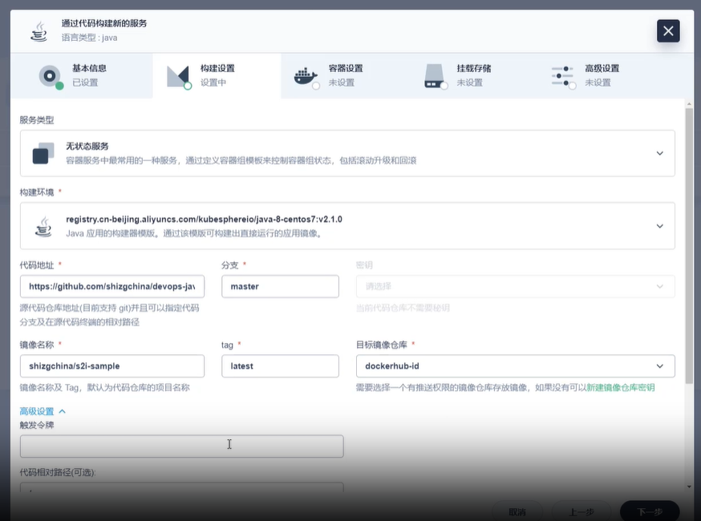
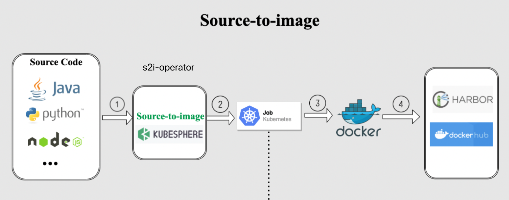
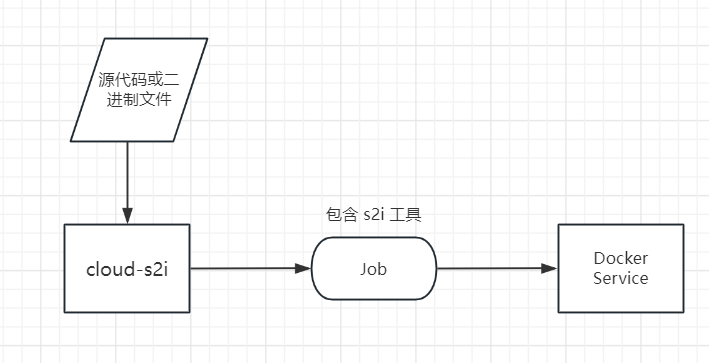

## 背景介绍
提供`源码`或者`二进制文件`构造镜像的工具，减少开发者手动编写 Dockerfile 的需求。

## S2I (source-to-image) 工具 ⭐️2.4k
openshift 提供了源码构造镜像的工具（s2i），而 kubeshift 也是使用该工具（同时提供二进制文件构造镜像）

### S2I 的优点
1. **简化构建流程**：S2I 脚本可以将编译、打包和其他构建步骤封装起来，使得用户只需要提供源代码就可以创建容器镜像。与 Dockerfile 相比，这种方式可以更简单地构建出应用的 Docker 镜像。

2. **提高安全性**：在 Dockerfile 中，构建过程可能会包含运行在 root 用户权限下的命令，这可能会带来安全风险。与之相比，S2I 构建过程运行在一个隔离的容器中，这个容器是以普通用户权限运行，从而减少了潜在的安全问题。

3. **支持增量构建**：S2I 支持增量构建，这意味着它可以重用之前构建的部分，从而加速构建过程。而 Dockerfile 缺乏这种增量构建的支持。

4. **可重用和可共享**：S2I 脚本可以在不同的应用和项目之间重用，这使得构建流程可以更容易地在团队或者组织之间共享。

### S2I 基本原理
S2I 工具的基本原理是运行构建器镜像（安装编译等依赖），拷贝源代码到构建器镜像里（默认目录为`/tmp/src`），运行 `assemble` 脚本，设置 `run` 脚本为启动命令，然后执行 `docker commit` 命令提交新的镜像。



**NOTE:** 目前只支持 `docker`

S2I 一般包含以下文件：
- Dockerfile 定义了基本的构建器镜像
- s2i/bin/assemble 编译应用脚本
- s2i/bin/usage 构建器的使用方法
- s2i/bin/run 定义如何运行应用
- s2i/bin/save-artifacts 用于管理增量构建过程中的所有依赖的脚本

### 构建器 Dockerfile 文件
```Dockerfile
# golang-builder
FROM golang:1.18.10

ENV CGO_ENABLED=0 \
    GOOS=linux \
    GOCACHE=/tmp \
    STI_SCRIPTS_PATH=/usr/libexec/s2i \
    SOURCE_DIR=/go/src/app \
    APP_ROOT=/opt/app-root

LABEL io.k8s.description="Builder image for compiling and testing Go applications" \
      io.k8s.display-name="golang-builder" \
      io.openshift.s2i.scripts-url=image://${STI_SCRIPTS_PATH}
      
# Copy the s2i scripts into the golang image
# These scripts describe how to build & run the application, and extract artifacts 
# for downstream builds
COPY ./s2i/bin/ $STI_SCRIPTS_PATH

# The $SOURCE_DIR is dependent on the upstream golang image, based on the 
# $GOPATH, etc. variable set there
#
# Allow random UIDs to write to the $SOURCE_DIR (for OKD/OpenShift)
RUN mkdir -p $SOURCE_DIR \
      && chmod 755 $SOURCE_DIR \
      && mkdir -p $APP_ROOT \
      && chmod 755 $APP_ROOT \
      && chown -R 1001:0 $SOURCE_DIR \
      && chown -R 1001:0 $APP_ROOT \
      && chmod -R 755 $STI_SCRIPTS_PATH \
      && chown -R 1001:0 $STI_SCRIPTS_PATH

WORKDIR $SOURCE_DIR

# Drop root (as is tradition)
USER 1001

CMD ["/usr/libexec/s2i/usage"]
```
### assemble 脚本
对于 golang 语言，如果有依赖第三方包，必须引入 `vendor` 目录
```bash
# assemble script

# If the 'golang-builder' assemble script is executed with the '-h' flag, print the usage.
if [[ "$1" == "-h" ]]; then
	exec /usr/libexec/s2i/usage
fi

# Restore artifacts from the previous build (if they exist).
if [ "$(ls /tmp/artifacts/ 2>/dev/null)" ]; then
  echo "---> Restoring build artifacts..."
  mv /tmp/artifacts/. ./
fi

echo "---> Installing application source..."
cp -Rf /tmp/src/. ./

# warning if `vendor` is not present
if [[ ! -d ./vendor ]]; then
  echo "WARN: Package is missing dependencies."
fi

echo "---> Building application from source..."
go build -mod=vendor -o /opt/app-root/ ./...
chmod -R 755 /opt/app-root/
```

### run 脚本
考虑了传入参数
```bash
first_file=$(find "/opt/app-root" -maxdepth 1 -type f | head -n 1)
exec $first_file $*
```

### assemble-runtime 脚本
对于 Go、C、C++、Java 等编译型语言，编译时所需的依赖项会增加最终镜像的大小。为构建更轻量的镜像，S2I 实行分阶段构建，并从镜像中移除非必要的文件。镜像构建器完成构建后会导出制品，制品可能是 Jar 文件或二进制文件等可执行文件，然后会将制品注入运行时镜像 (Runtime Image) 用于执行。
基本过程如下图所示：


### S2I builder 命令
```bash
s2i build ./source-to-image obitoquilt/s2i-go-builder:latest s2i latest
```
### S2I runtime 命令
```bash
s2i build ./source-to-image obitoquilt/s2i-go-builder:latest s2i latest --runtime-image obitoquilt/s2i-go-runtime:latest --runtime-artifact /opt/app-root --copy
```

## B2I (Binary-to-Image) 工具
kubeshift 是基于 S2I 工具实现二进制文件构建镜像，通过构建器镜像拷贝二进制文件完成。

### assemble 脚本
```bash
BINARY_NAME="$(ls /tmp/src/ 2>/dev/null)"

if [ ! -n "$BINARY_NAME" ]; then
  echo "do not find binary file"
  exit 1
fi

echo "found binary file \"$BINARY_NAME\""

echo "mv binary file \"$BINARY_NAME\" to /deployments/ & rename to \"binary\" "

mv -f /tmp/src/$BINARY_NAME $APP_ROOT/bin/binary

chmod +x $APP_ROOT/bin/binary
```

### run 脚本
```bash
echo "run binary with ARGS $ARGS"

exec $APP_ROOT/bin/binary $ARGS
```

## kubesphere 源代码转化镜像页面



## 方案设计
### kubesphere s2i-operator 模式
通过 `CRD controller` 的方式创建 Job 来将源代码注入构建器镜像，执行相应的脚本文件，提交新镜像到镜像仓库。

维护每个 Job 的状态和获取相关 pod 的日志信息


#### S2I 模板
通过 CR 定义某种语言或框架下的`构建器镜像`和`运行时镜像`。
```yaml
apiVersion: devops.kubesphere.io/v1alpha1
kind: S2iBuilderTemplate
metadata:
  labels:
    controller-tools.k8s.io: "1.0"
    builder-type.kubesphere.io/s2i: "s2i"
  name: nginx-demo
spec:
  containerInfo:
    - builderImage: kubespheredev/nginx-centos7-s2ibuilder-sample
  codeFramework: nginx # type of code framework
  defaultBaseImage: kubespheredev/nginx-centos7-s2ibuilder-sample # default Image Builder (can be replaced by a customized image)
  version: 0.0.1 # Builder template version
  description: "This is an S2I builder template for NGINX builds whose result can be run directly without any further application server." # Builder template description
```
#### 缺点：
1. Job 所需的 s2irun 镜像由 kubesphere 二次开发 openshift 的 source-to-image，最近一次更新是 2 年前。
2. 目前只支持源代码仓库地址

## 原生 S2I
前端页面选择构建器、源代码仓库地址或者源代码等信息后，cloud-s2i 服务创建 Job 并传递参数，Job 利用原生的 s2i 工具执行命令生成新的镜像，并推送到镜像仓库中。



## 参考资料
1. [runtime-image](https://github.com/openshift/source-to-image/blob/30d81a9440f30b472bb32e592b12c1a83a396edd/docs/runtime_image.md)
2. [kubesphere/s2i-binary-container](https://github.com/kubesphere/s2i-binary-container/tree/master)
3. [Source to Image：无需 Dockerfile 发布应用](https://www.kubesphere.io/zh/docs/v3.3/project-user-guide/image-builder/source-to-image/)
4. [Binary to Image：发布制品到 Kubernetes](https://www.kubesphere.io/zh/docs/v3.3/project-user-guide/image-builder/binary-to-image/)
5. [kubesphere/s2irun](https://github.com/kubesphere/s2irun/blob/master/docs/builder_image.md#s2i-builder-image-requirements)
6. [自定义 S2I 模板](https://www.kubesphere.io/zh/docs/v3.3/project-user-guide/image-builder/s2i-templates/)
7. [Creating an s2i builder for Go (and a runtime image)](https://dev.to/jromero/creating-an-s2i-builder-for-go-and-a-runtime-image-5d56)
8. [kubesphere/s2ioperator](https://github.com/kubesphere/s2ioperator)